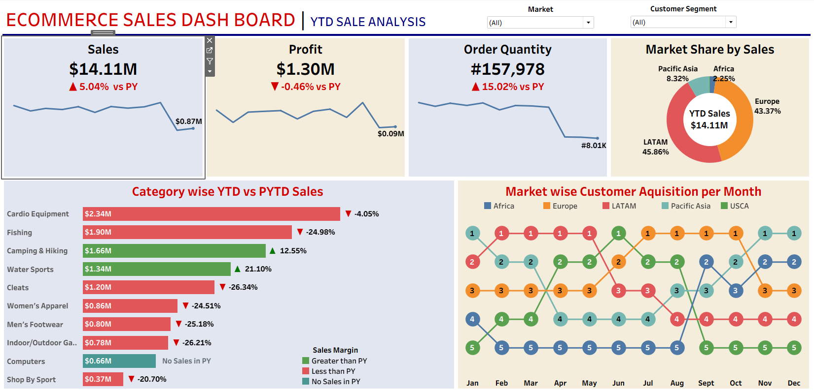

## 📊 Ecommerce Sales Analytics Dashboard – Tableau Project

## 🌐 Live Interactive Dashboard
🔎 Explore Here:
👉 https://public.tableau.com/app/profile/manikantan.p/viz/ECOMMERCESALESDASHBOARD_17693330562520/ECOMMERCESALESDASHBOARD

## 📌 Project Overview

This project presents an interactive E-commerce Sales Analytics Dashboard developed using Tableau to analyze revenue performance, customer behavior, and regional sales trends.

The dashboard enables business stakeholders to monitor key performance indicators (KPIs) and make data-driven decisions to improve sales strategy and profitability.

## 🎯 Objectives

Analyze overall sales revenue and order performance

Identify top-performing products and categories

Evaluate regional sales distribution

Track key business KPIs

Provide actionable insights for revenue growth

## 🛠️ Tools & Technologies

Tableau – Dashboard Development & Data Visualization

Microsoft Excel / CSV – Data Cleaning & Preparation

Business Intelligence & Data Analysis Techniques

## 📊 Key Dashboard Features

KPI Cards (Total Sales, Total Orders, Profit)

Category-wise & Product-wise Sales Analysis

Region-wise Performance Breakdown

Sales Trend Visualization

Interactive Filters for Dynamic Exploration

## 📸 Dashboard Overview




## 📈 Business Insights

Identified top revenue-generating product categories

Highlighted underperforming regions requiring strategic focus

Observed sales trends and revenue fluctuations

Provided insights to support pricing and inventory decisions

## 📂 Project Structure
```
Ecommerce-Sales-Analytics-Tableau/
│
├── data/
├── dashboard/
├── screenshots/
└── README.md
```

## 👨‍💻 Author

ManiKantan P
Business Analyst | Tableau | Power BI | SQL | Python
